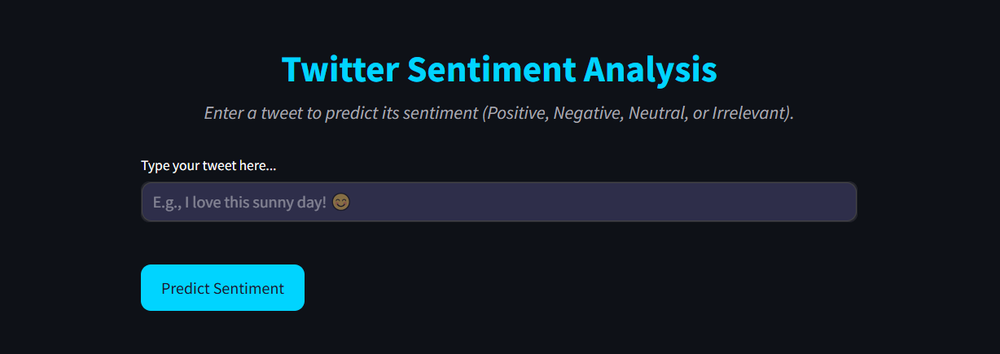

# Twitter Sentiment Analysis with LSTM

 <!-- Add a screenshot of your Streamlit app or accuracy plot here -->

A machine learning project for classifying Twitter sentiments (Positive, Negative, Neutral, Irrelevant) using an LSTM model built with TensorFlow/Keras. This is a many-to-one sequence classification task, trained on a dataset of labeled tweets. Includes data preprocessing, model training, evaluation, and an interactive Streamlit app for real-time predictions.

## Project Overview
This project analyzes tweet sentiments to help understand public opinion on various entities (e.g., brands, games). The LSTM model captures sequential dependencies in text, making it suitable for NLP tasks. Key steps include:
- Data cleaning and preprocessing (removing URLs, mentions, stopwords, stemming).
- Tokenization and padding sequences.
- Building and training an LSTM model with embedding layers.
- Evaluating performance with accuracy, loss plots, and classification reports.
- Deploying an interactive GUI via Streamlit for user predictions.

Dataset: ~74k training tweets and 1k validation tweets from CSV files (multi-class labels: Positive, Negative, Neutral, Irrelevant).

## Features
- **Multi-Class Classification**: Predicts 4 sentiment classes.
- **Visualizations**: Training accuracy/loss plots, classification reports.
- **Interactive Demo**: Streamlit app to input tweets and get predictions with confidence scores.
- **Reproducible**: Saved model and tokenizer for easy loading.

## Technologies Used
- Python 3.x
- TensorFlow/Keras (LSTM model)
- Pandas, NumPy, Matplotlib, Seaborn (data handling and viz)
- NLTK (text preprocessing)
- Scikit-learn (metrics)
- Streamlit (GUI)
- Pickle (saving tokenizer)

## Installation
1. Clone the repository:
